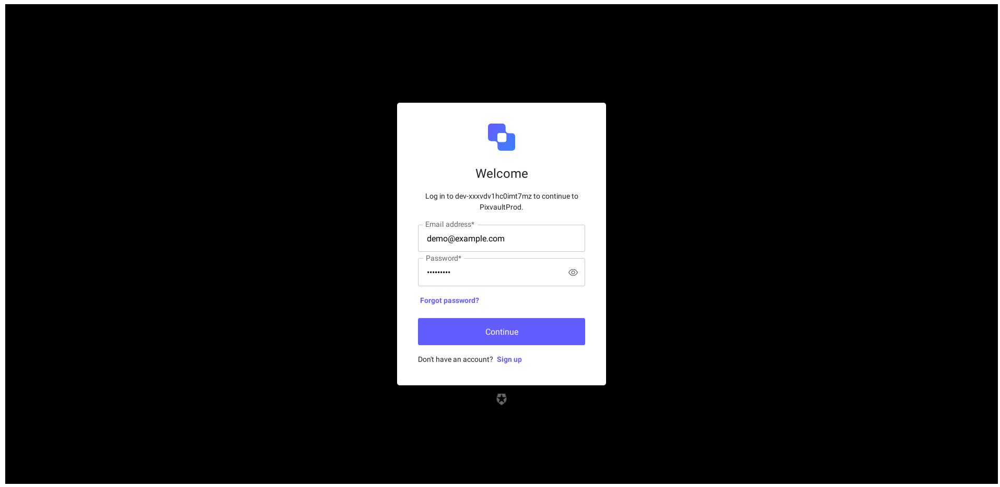
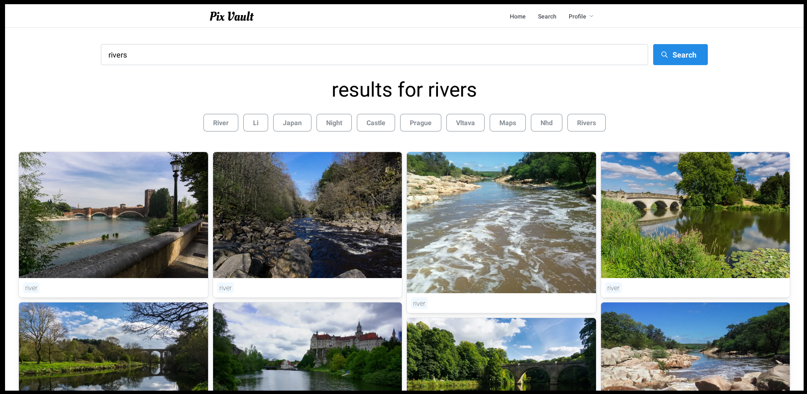
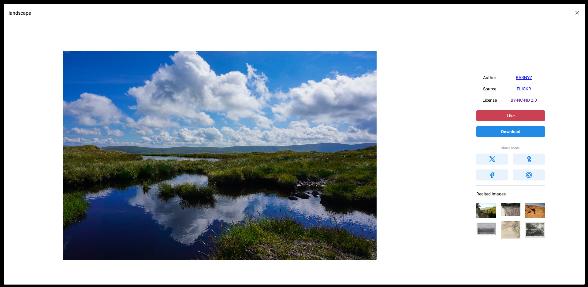
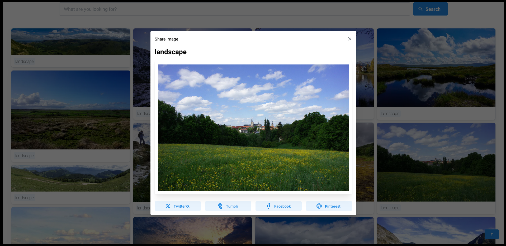
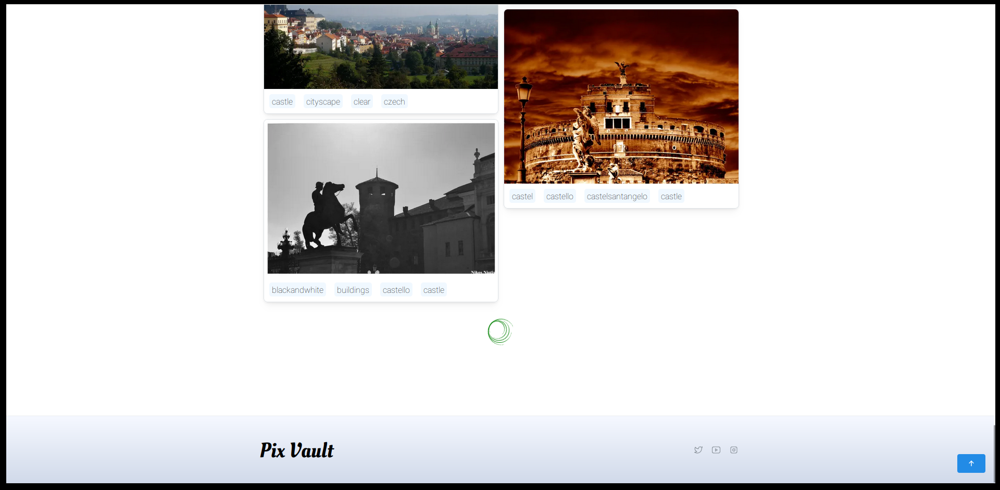
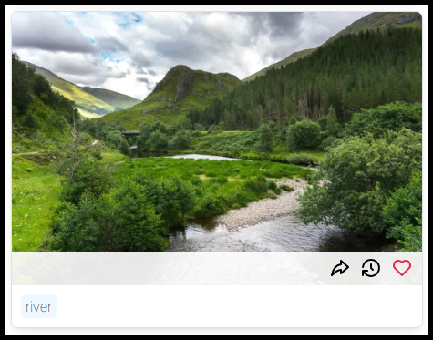
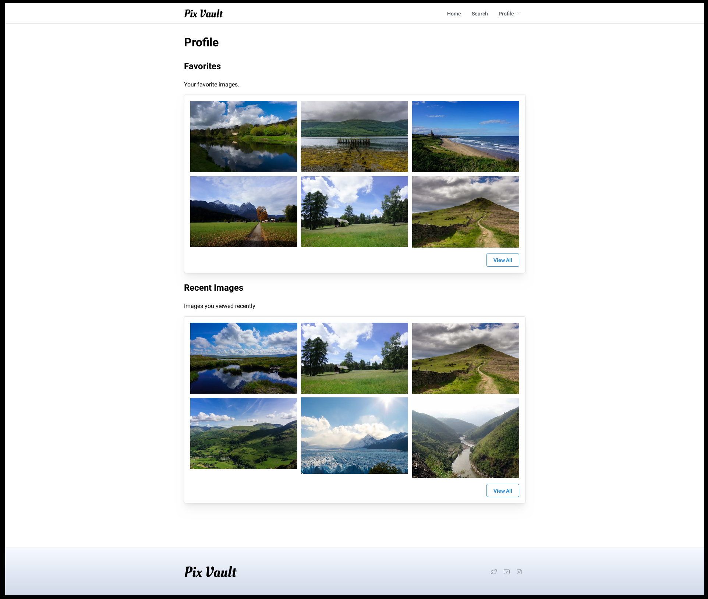
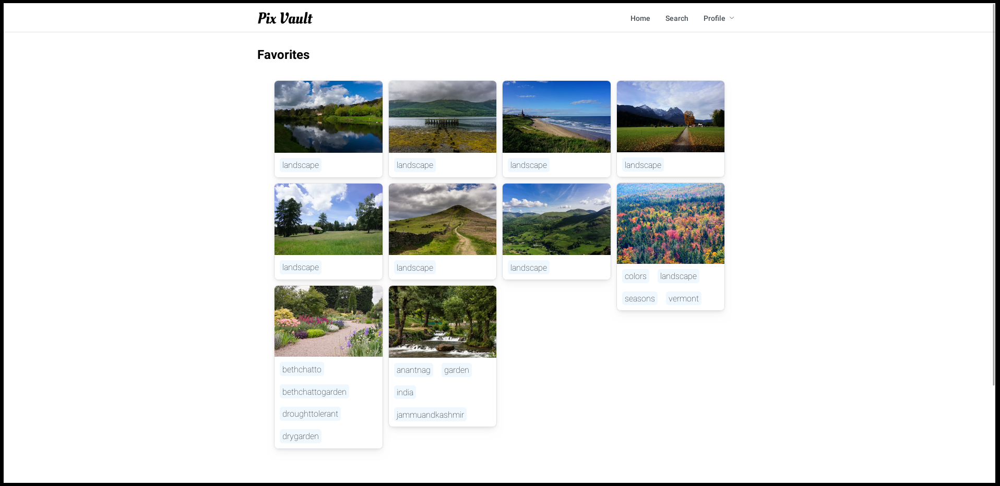
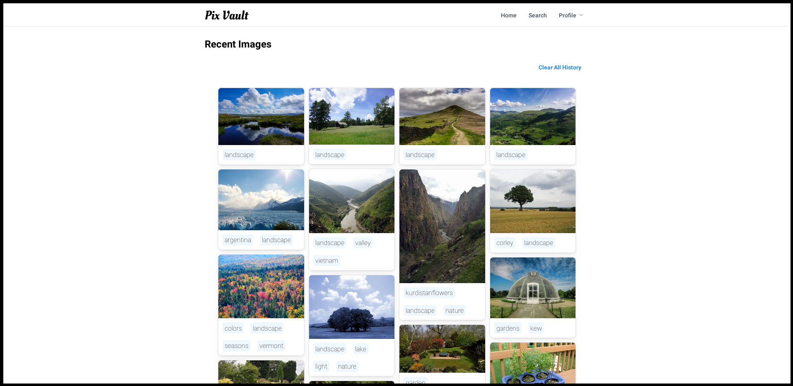

**Pixvault: A MERN Stock Image Website**

Pixvault is a robust stock image website built with the MERN stack (MongoDB, Express, React, and Node.js) for a seamless user experience. It empowers users to view, manage, and download images, making it ideal for designers, bloggers, and anyone seeking exceptional visuals.

This is the frontend repo. Check out the [backend repo](https://github.com/2brownc/pixvault-backend).

**Gallery:**

Landing Page  


Login  


Search  


Image View  


Share Menu  


Infinite Scroll  


Thumbnail View  


Profile  


Favorites  


History  


**Key Features:**

- **CRUD Functionality:** Create, Read, Update, and Delete images, allowing for comprehensive image management.
- **Secure Authentication:** Leverages Auth0 for secure user login and authorization, ensuring data privacy and trust.
- **Typescript Development:** Enhances code maintainability, type safety, and developer experience.
- **React Redux State Management:** Provides a centralized state management solution for a predictable and efficient user interface.
- **Mantine UI Integration:** Offers a modern and responsive design framework for an intuitive user experience.

**Getting Started**

1. **Prerequisites:** Node.js (version 18 or later) and npm (Node Package Manager) are required. You can download them from the official Node.js website: [https://nodejs.org/en](https://nodejs.org/en).
2. **Clone the Repository:** Open your terminal and navigate to your desired project directory. Then, run the following command to clone this repository:

   ```bash
   git clone https://github.com/2brownc/pixvault-frontend.git
   ```

3. **Install Dependencies:** Navigate to the project directory and install the required dependencies using npm:

   ```bash
   cd pixvault-frontend
   npm install
   ```

4. **Environment Variables:** Create a `.env.local` file in the project root directory and configure the following environment variables:

   ```
   VITE_AUTH0_AUDIENCE
   VITE_AUTH0_CLIENTID
   VITE_AUTH0_DOMAIN

   VITE_ANONAUTH_TOKEN #anonymous auth using JWT

   VITE_HOME_SEARCHTERM
   VITE_DEFAULT_SEARCHTERM

   VITE_DEMO_EMAIL
   VITE_DEMO_PASS

   VITE_SERVER_URL  #backend server url
   VITE_SERVER_CROSS_ORIGIN #same as server url if on same domain, else set to '*'
   ```

5. **Start the Development Server:** Run the following command to start the development server:

   ```bash
   npm start
   ```

   This will launch the app at `http://localhost:5173` in your browser.

**Deployment**

Instructions on deploying Pixvault to a production environment will be added in a future update.
